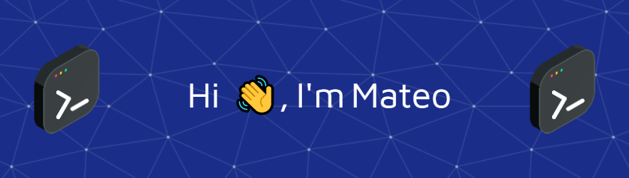

<!-- 
  
  <a href="https://www.linkedin.com/in/mateogarciag" align="left" style="padding:20px">
  Linkedin Profile</a>

  <a href="https://github.com/MateoGarciaG/MateoGarciaG" style="padding:20px">README Curriculum Vitae</a>

 -->

<!--
**MateoGarciaG/MateoGarciaG** is a ✨ _special_ ✨ repository because its `README.md` (this file) appears on your GitHub profile.

Here are some ideas to get you started:

- 🌱 I’m currently learning TypeScript, NodeJs
- 👯 I’m looking to collaborate on projects that use TypeScript, NodeJS, NestJS and React/NextJS
- 🤔 I’m looking for help with ...
- 💬 Ask me about ...
- 📫 How to reach me: ...
- 😄 Pronouns: ...
- ⚡ Fun fact: ...
-->

<!-- 

 -->

<!--  --> 

<!-- <h1 align="center">Hi 👋, I'm Mateo Garcia</h1> -->
<h2 align="center">Software Developer 👨‍💻</h2>

---

I present myself as a proactive person, with a good attitude and always ready to collaborate in any way possible. I always try to give the best of me, where I can contribute the most in projects and in a work team.

- 🌱 I’m currently learning as a self-taught person in TypeScript with NodeJS and React together with their environments

- 👯 I’m a proactive person who is guide by his passion on programming

- 👨‍💻 All my personal projects are available at: [My Projects](https://github.com/MateoGarciaG?tab=repositories)

- ⚡ My projects while I was a Student: [My Projects](https://github.com/MateoGarciaG?tab=repositories)

 

##  ⚡ Programming Languages

  

 

##  ⚡ Frontend Development

   <a href="https://tailwindcss.com/" target="_blank" rel="noreferrer">    

 

## ⚡ Backend Development

    

 

## ⚡ Database Skills

   

 

## ⚡ Other Skills

 

 

## ⚡ Tools

 

 

<h4> Details about my GitHub </h4>

<a href="https://github.com/MateoGarciaG?tab=repositories">

 

